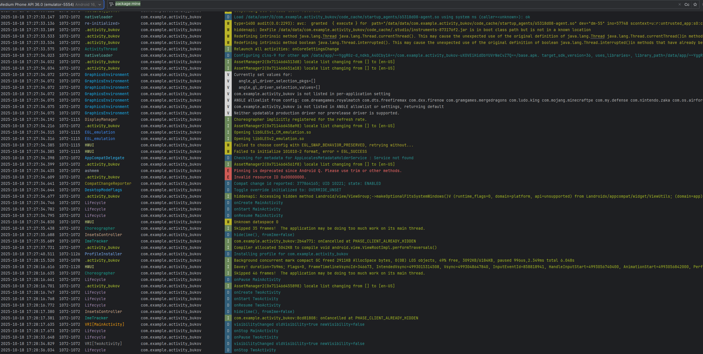

# Activity_Bukov

Простой Android проект с двумя Activity, демонстрирующий работу **явных и неявных интентов** и жизненный цикл Activity.

## Функции приложения

- MainActivity:
    - Кнопка "Открыть TwoActivity"
- TwoActivity:
    - Показывает текст «Я запустился!»
    - Кнопка "Открыть браузер" — открывает сайт [developer.android.com](https://developer.android.com)
    - Кнопка "Вернуться назад" — закрывает активити
- Логирование жизненного цикла в Logcat для обеих Activity

## Установка

Скрины




1. Клонируйте репозиторий:

```bash
git clone https://github.com/AndreyCorpse280990/Activity_Bukov.git


